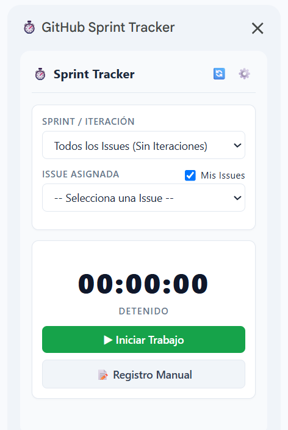
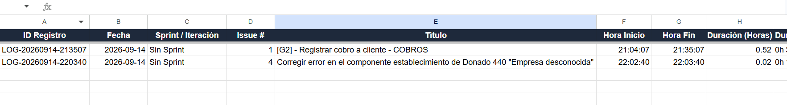
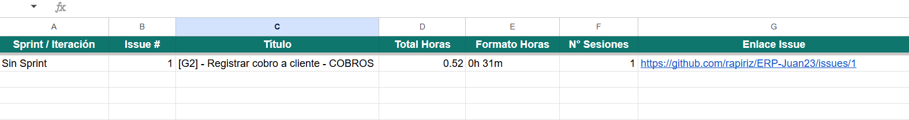
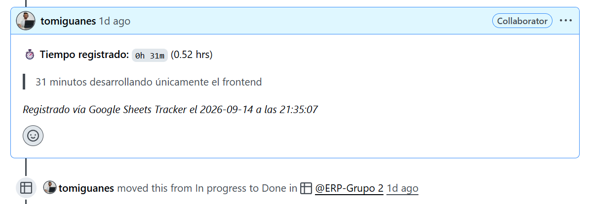

# GitHub Sprint Time Tracker para Google Sheets

<div align="center">


<p align="center">
  <b>Herramienta integrada y sin servidores para cronometrar, registrar y sincronizar horas de desarrollo de software por Sprint / Iteración directamente entre GitHub Projects (v2) y Google Sheets.</b>
</p>

</div>

---

<div align="center">
  
  
  
  

</div>

> [!TIP]
> **100% Serverless y Privado**: Funciona de punta a punta dentro de tu entorno de Google Workspace. No necesita servidores intermedios, bases de datos externas ni suscripciones de terceros.

---

## Características Principales

- **Cronómetro Persistente en Vivo**: Arrancá, pausá y reanudá el tiempo de trabajo. Si cerrás la pestaña, apagás la compu o recargás la página, el cronómetro no se pierde gracias a que el estado se guarda en `PropertiesService`.
- **Sincronización con GitHub Projects (v2)**: Lee automáticamente las iteraciones o sprints activos de tu tablero y te lista únicamente los issues asignados a vos.
- **Actualizaciones Automáticas en GitHub**:
  - Al arrancar el cronómetro, puede mover la tarea a `In Progress`.
  - Al detener y registrar la sesión, te permite elegir el nuevo estado (`In Review`, `Done`, etc.).
  - Publica de forma automática un comentario en el issue con el desglose exacto de tiempo y las notas de la sesión.
- **Doble Estructura en Google Sheets**:
  - **`Registro Detallado`**: Historial fila por fila de cada sesión (ID, Fecha, Sprint, Issue #, Título, Hora Inicio, Hora Fin, Horas decimales, Horas formato texto, Notas, Estado y Enlace).
  - **`Resumen por Issue`**: Tabla consolidada que totaliza automáticamente el tiempo acumulado y la cantidad de sesiones por cada tarea y sprint.
- **Carga Manual Alternativa**: Te permite registrar bloques de tiempo transcurridos por si te olvidaste de arrancar el cronómetro.
- **Seguridad y Privacidad de Credenciales**: El Personal Access Token (PAT) se guarda en las propiedades privadas del usuario (`PropertiesService.getUserProperties()`), lo que garantiza que **nunca quede expuesto en las celdas de la hoja ni sea visible para otros colaboradores**.
- **Soporte Multi-Zona Horaria**: Detecta dinámicamente la zona horaria configurada en tu hoja de cálculo o en tu entorno de Google.

---

## Estructura del Repositorio

```text
├── src/
│   ├── Code.gs             # Backend en Google Apps Script (GraphQL, Sheets y Timer)
│   ├── Sidebar.html        # Interfaz de usuario de la barra lateral (HTML/CSS/JS)
│   ├── ConfigDialog.html   # Modal de credenciales y prueba de conexión con GitHub
│   └── appsscript.json     # Manifiesto de Apps Script (OAuth scopes y configuración)
├── .gitignore              # Exclusiones de Git (archivos locales, clasp, SO)
├── LICENSE                 # Licencia MIT
└── README.md               # Documentación y guía de instalación
```

| Archivo | Descripción |
| :--- | :--- |
| [`src/Code.gs`](./src/Code.gs) | Backend en Apps Script: lógica de sincronización GraphQL, mutaciones, timer y formateo de Sheets. |
| [`src/Sidebar.html`](./src/Sidebar.html) | Frontend de la barra lateral: cronómetro, selector de tareas por sprint y modal de guardado. |
| [`src/ConfigDialog.html`](./src/ConfigDialog.html) | Diálogo de configuración para ingresar y validar las credenciales de GitHub de forma segura. |
| [`src/appsscript.json`](./src/appsscript.json) | Manifiesto de permisos requeridos y versión de runtime (V8). |

---

## Guía de Instalación

Podés configurar el proyecto en menos de 5 minutos mediante cualquiera de los siguientes métodos:

### Opción 1: Copia directa (Crear una  copia de una hoja preconfigurada con el código)
https://docs.google.com/spreadsheets/d/187UjXKfWjCBEcvivS8SN0lmQ7e-0G9tw6jZ8y26x4fU/edit?usp=sharing 
1. Abre la Plantilla de Google Sheets (Copia Rápida) (puedes enlazar aquí tu propia plantilla pública).
2. Haz clic en Hacer una copia.
3. Continúa directamente a la sección: Configuración.

### Opción 2: Instalación Manual Paso a Paso
1. Abrí [Google Sheets](https://sheets.new) y creá una hoja en blanco nueva.
2. En el menú superior, andá a **Extensiones > Apps Script**.
3. En el editor de Apps Script:
   - En el archivo `Código.gs` (o `Code.gs`), reemplazá todo su código por el contenido de [`src/Code.gs`](./src/Code.gs).
   - Hacé clic en **+** (Añadir archivo) > **HTML**, nombralo `Sidebar` y pegá el código de [`src/Sidebar.html`](./src/Sidebar.html).
   - Hacé clic en **+** (Añadir archivo) > **HTML**, nombralo `ConfigDialog` y pegá el código de [`src/ConfigDialog.html`](./src/ConfigDialog.html).
   - *(Opcional)* Andá a **Configuración del proyecto** (ícono de engranaje), tildá la casilla **Mostrar archivo de manifiesto "appsscript.json" en el editor**, volvé a la pestaña de archivos y reemplazá el contenido de `appsscript.json` por [`src/appsscript.json`](./src/appsscript.json).
4. Hacé clic en el ícono de **Guardar** o presioná `Ctrl + S`.

#### Configuración de la hoja antes de comenzar a usarla
1. Volvé a tu hoja de cálculo y recargala (**F5**).
2. Vas a ver aparecer un nuevo menú superior llamado **GitHub Tracker**.
3. Hacé clic en **GitHub Tracker > Inicializar Hojas de Cálculo**.
4. Google te va a pedir autorizar los permisos del script por primera vez:
   - Hacé clic en **Continuar** y seleccioná tu cuenta de Google.
   - En la advertencia de verificación de Google, hacé clic en **Avanzado** y después en **Ir a (proyecto) (no seguro)** para concederle acceso a tu propia hoja.
5. El script va a crear y formatear automáticamente las dos hojas de trabajo:
   - `Registro Detallado`
   - `Resumen por Issue`

#### Conectar tu Proyecto de GitHub
1. Hacé clic en **GitHub Tracker > Configuración de GitHub**.
2. Completá los datos solicitados:
   - **Personal Access Token (PAT)**: 1. En GitHub, andá a **Settings > Developer Settings > Personal Access Tokens > Tokens (classic)**.
                                      2. Hacé clic en **Generate new token (classic)**.
                                      3. Asignale una descripción (ej. `Google Sheets Time Tracker`).
                                      4. Seleccioná los permisos (*scopes*) mínimos requeridos:
                                         - `repo` (Acceso a repositorios públicos o privados, issues y comentarios).
                                         - `read:project` y `project` (Lectura y actualización en GitHub Projects v2).
                                      5. Hacé clic en **Generate token** y copia el token generado (`ghp_...`).
                                      > *Nota: También podés usar Fine-grained Personal Access Tokens con permisos equivalentes de lectura y escritura para Issues y Projects.*
   - **Tipo de Dueño**: Elegí `Organización` o `Usuario Personal`.
   - **Organización / Usuario**: El identificador de usuario u organización dueña del proyecto.
   - **Nombre del Repositorio**: El nombre del repo donde están los issues.
   - **Número del Project (v2)**: El número visible en la URL del proyecto (ej: `github.com/orgs/mi-org/projects/3` -> el número es `3`).
   - **Tu Usuario de GitHub**: Tu usuario para filtrar las tareas asignadas a vos.
3. Hacé clic en **Probar Conexión** para validar la comunicación.
4. Hacé clic en **Guardar**.


---

### Opción 3: Para Desarrolladores (Google Clasp)

Si preferís laburar localmente y desplegar mediante la CLI oficial de Google:

```bash
# 1. Instalar Google Clasp globalmente
npm install -g @google/clasp

# 2. Iniciar sesión en tu cuenta de Google
clasp login

# 3. Clonar un Apps Script existente o crear uno nuevo
clasp clone <SCRIPT_ID> --rootDir ./src

# 4. Enviar los cambios locales a la nube
clasp push
```

---

## Flujo de Trabajo Diario

1. Abrí el menú **GitHub Tracker > Abrir Cronómetro**.
2. En la barra lateral, seleccioná el **Sprint / Iteración** y el **Issue** en el que vas a laburar.
3. Hacé clic en **Iniciar Trabajo**:
   - El cronómetro va a empezar a correr.
   - Si está configurado, el issue va a cambiar al estado `In Progress` en tu GitHub Project.
   - Podés cerrar la pestaña si querés; el tiempo va a seguir calculándose con total precisión.
4. Podés pausar y reanudar con **Pausar** y **Reanudar** según lo necesites durante el día.
5. Al finalizar:
   - Hacé clic en **Detener**.
   - Ingresá o revisá los minutos trabajados y sumá notas del progreso realizado.
   - Elegí el nuevo estado del issue (ej. `In Review` o `Done`).
   - Hacé clic en **Guardar Registro**.
6. **Resultado inmediato**:
   - Se agrega la fila en `Registro Detallado`.
   - Se actualiza automáticamente la tabla en `Resumen por Issue`.
   - Se publica el comentario en el issue de GitHub.
   - Se actualiza la columna del tablero en GitHub Projects v2.

---

## Seguridad y Buenas Prácticas

- **Cero exposición de credenciales**: El token nunca se almacena en celdas, fórmulas ni variables públicas.
- **Acceso acotado**: Solo requiere los permisos indispensables (`spreadsheets`, `script.container.ui` y `script.external_request`) para interactuar con la hoja y la API GraphQL de GitHub.
- **Auditoría de código**: Todo el código fuente está disponible en este repositorio para revisión y auditoría antes de su despliegue.

---

## Contribuciones

¡Las contribuciones, sugerencias y reportes de errores son más que bienvenidos!

1. Hacé un Fork del proyecto.
2. Creá una rama para tu feature (`git checkout -b feature/nueva-funcionalidad`).
3. Realizá tus cambios y hacé commit (`git commit -m 'feat: agrega nueva funcionalidad'`).
4. Subí tu rama (`git push origin feature/nueva-funcionalidad`).
5. Abrí un **Pull Request**.

---

## Licencia

Este proyecto está bajo la Licencia MIT. Consultá el archivo [LICENSE](./LICENSE) para más detalles.
